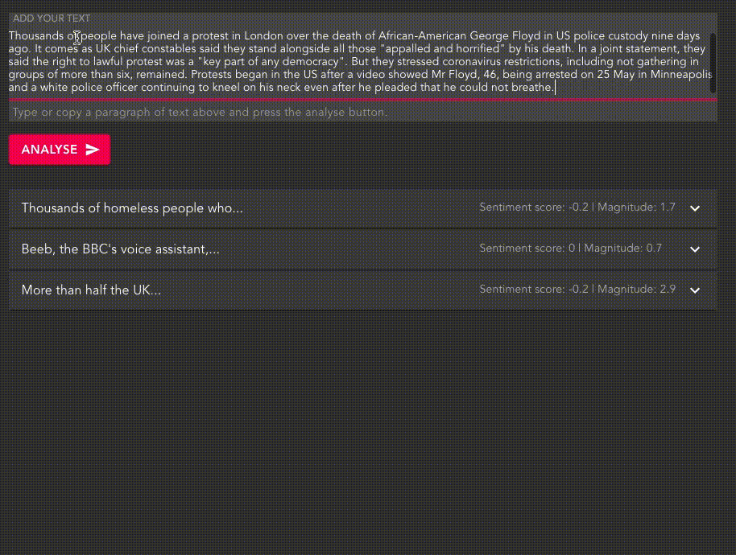

## react-sentiment-analyser

- This project focuses on developing a clean front-end tool to illustrate some intuitive concepts behind Natural Language Processing (NLP).
- [Google Cloud NLP APIs](https://cloud.google.com/natural-language) were used to provide insightful text analysis (including entity extraction, document & entity level sentiment analysis, and parts-of-speech classification).
- The react app was boostrapped using [Create React App](https://github.com/facebook/create-react-app).

## What the app looks like...

## Available Scripts

In the project directory, you can run:

### Install dependencies : `npm i` or `npm install`
- Executes installation of all dependencies listed in the package.json file.
- On running this command, in the root folder, a `node_modules` directory will be created and all depdencies will be downloaded and installed within.

### Run the app in your browser : `npm start`
- Runs the app in the development mode.
- Open [http://localhost:3000](http://localhost:3000) to view it in the browser.
- The page will reload if you make edits.
- You will also see any lint errors in the console.

## Data storage
- With the app primarily focused on illustrating a neat front-end design to demonstrate NLP concepts, there is no centralised data capture of related data, beyond the browser.
- `LocalStorage` is utilised to manage state beyond a single browser session (i.e. if you restart your app, the app will attempt to load data from localStorage, if available).

